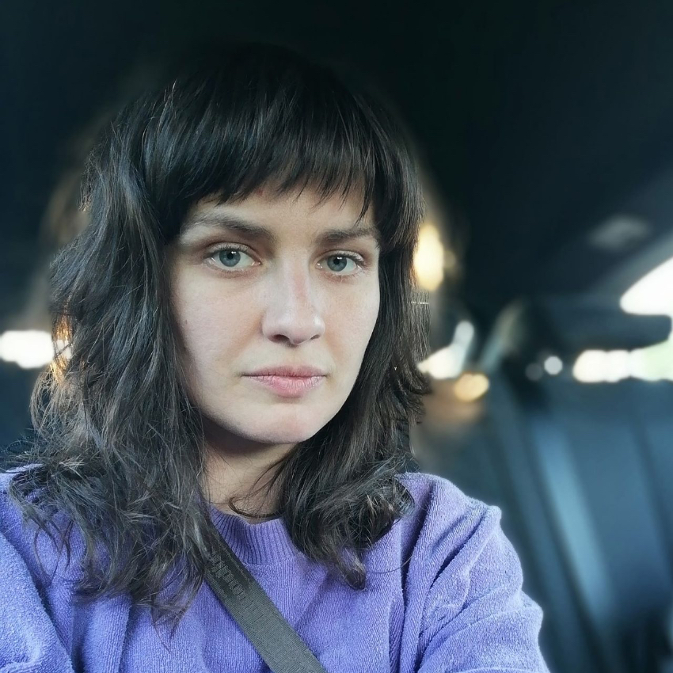
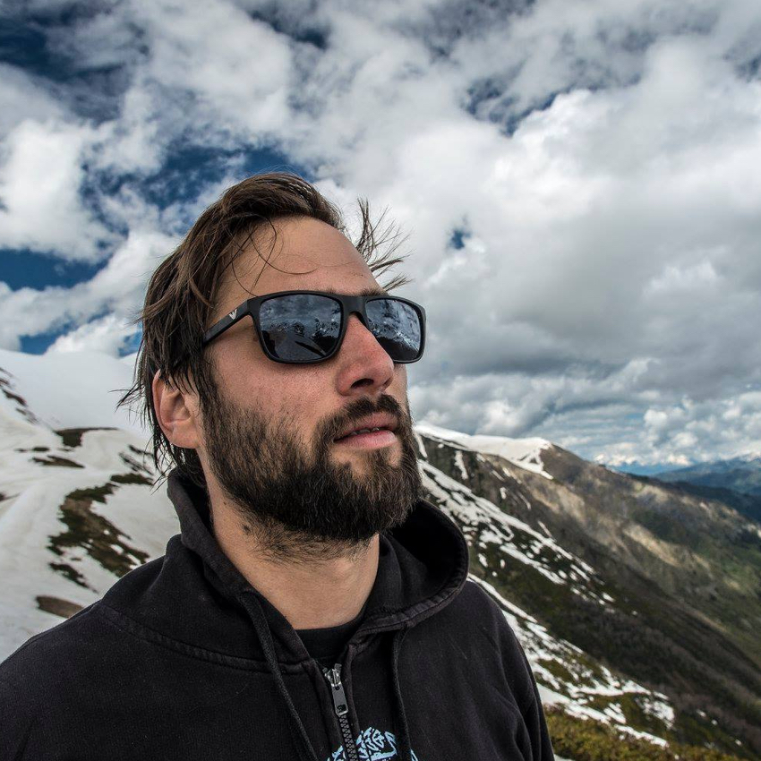

# O projektu 😴

Dům kultury a únavy je družba v podobě dvoudenní události v čase divadelních prázdnin ohledává nové možné role kulturní instituce vylamující se ze své úzké umělecké specializace. Výroční projekt vytváří dočasný prostor pro společné trávení času, ve kterém je možné estetickými i mimoestetickými perspektivami svobodně nahlížet nové potenciální zdroje utopického myšlení.

Kurátory prvního ročníku jsou výtvarná umělkyně Katarína Hládeková a sociolog Vojtěch Pecka. Jejich program nabízí společné setkání umělecké, sociologické, politologické či klimatologické scény a široké veřejnosti sevřené snahou hledat nové formy trávení volného času v době klimatického rozvratu. Dům kultury a únavy je možné navštívit kdykoli v průběhu dvou dnů jeho trvání, volně přicházet a odcházet, účastnit se programu i nedělat nic.

Volný čas jako by v lockdownové realitě splynul s časem pracovním. Obojí charakterizuje výkonnost a řízenost. I před pandemií se volný čas stával více výkonem než uvolněním. Volno, které je potřeba především zaplnit a prožít aktivně ve snaze nevypadnout z rytmu pozdního kapitalismu a živé tvorby své jedinečné identity. Když mluvíme o aktivismu a společenské změně, je právě volný čas a jeho potenciálně subverzivní prázdnota prostorem pro jinakost, která v našem světě mizí pod přívalem logiky produkce. Volný čas může být naším prostorem pro alternativní uvažování. Jaké formy kolektivního bytí nabízí čas (post)pandemické budoucnosti? Jak se vrátit k volnému času trávenému s druhými lidmi a co od něj očekávat? Jak (ne)plánovat? Jak hledat společně radost a energii pro utopické uvažování?

Klimatická krize, kterou virová odbočka dočasně vytlačila ze zájmu, nijak neustoupila. Vyvstává nutnost uvědomit si dopad změn a turbulentní globalizační reality na prožívání, psychologii i trávení každodenních chvil. Z utopie trvalého pokroku se pro mnohé stala noční můra a řada hlasů se obává planetárního vyhlazení. Jiná možná cesta je přesunout pozornost k obnově, odolnosti, adaptaci – jak osobní, emocionální, tak kolektivní, ekosystémové. Volný čas jako nová utopie!

Katarína Hládeková 🧶

Katarína Hládeková je umělkyně a pedagožka. Mezi její autorské zájmy patří zkoumání jazyka, společenská kritika, historie a povaha vizuálního zobrazení. Zajímá se o sebereferenční postupy v umění a napětí mezi nápodobou a realitou. Formálně se pohybuje na hranici médií objektu, instalace, fotografie a pohyblivého obrazu. Od roku 2012 se kromě volné tvorby věnuje i pedagogické činnosti. Aktuálně působí na FaVU v Brně. V roce 2016 byla nominovaná na Cenu Jindřicha Chalupeckého; v roce 2018 na Cenu NOVUM. Jako kurátorka je (spolu)autorkou několika výstavních projektů realizovaných Galerií TIC, kde sa aktivně podílí i na koncepci a realizaci výstavního programu. V roce 2019 v rámci kolektivu Café Utopia spolukurátorovala přehlídku ve veřejném prostoru Brno Art Open. V minulosti prošla několika projekty na hranici volného umění a vystavování (Galerie 1k15, Galerie Jádro, Solo offspace, GRAU kllktv). Ve svém volném čase píše recenze pro artalk.cz.

Vojtěch Pecka 🧵

Vojtěch Pecka vystudoval magisterský obor teoretická sociologie na Fakultě sociálních věd Univerzity Karlovy s ročním studijním pobytu ve Finsku na univerzitě v Jyväskyle a na ročním výzkumném pobytu na univerzitě v Ljubljani. Ve svém rozpracovaném dizertačním projektu na Fakultě sociálních studií na Masarykově univerzitě v Brně se zaměřuje na vztah těžebního průmyslu a klimatických změn. V širším kontextu je jeho výzkumným zájmem vztah společenského systému s geofyzikální a ekosystémovou realitou v antropocénu a reflexe tohoto vztahu v současné sociální teorii. Spolupracuje s komentářovým serverem A2larm.cz, kde participoval na přípravě cyklu článků o klimatické krizi „Budoucnost je teď“. Vedle sociologie spolupracuje na tvorbě výstav, videí, krátkých filmů a počítačových her.

    

     
     <label>Katarína Hládeková</label>  
    

    

        
        <label>Vojtěch Pecka</label>  
    

